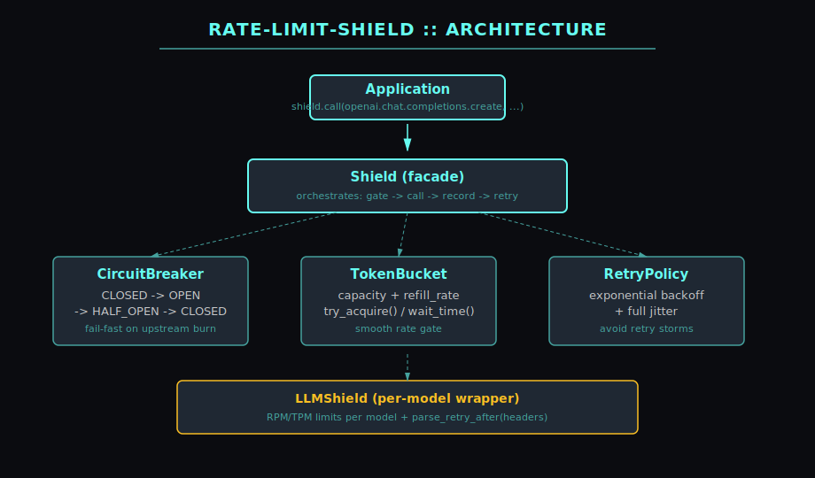
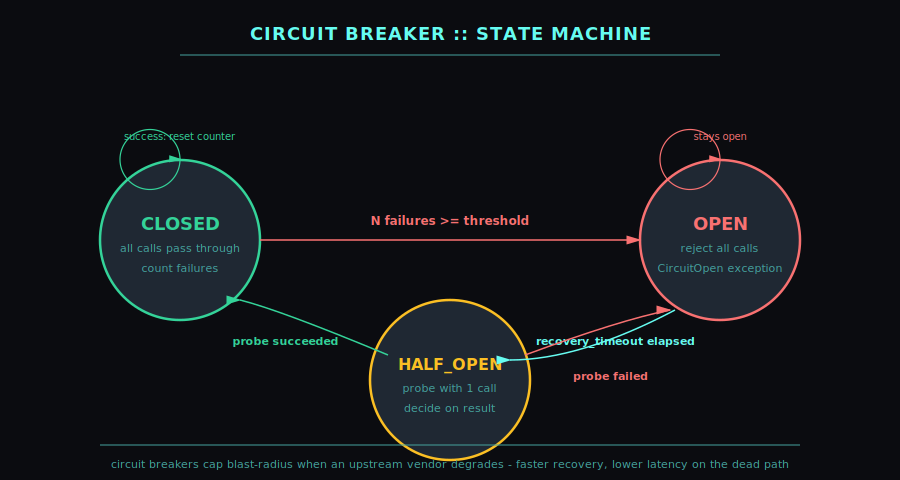

# rate-limit-shield 🛡️

> Production-grade rate limiting, circuit breaking, and retry shaping for LLM APIs.
> Token bucket + breaker + jittered backoff with HTTP 429 / `Retry-After` awareness.

[](https://github.com/mizcausevic-dev/rate-limit-shield/actions/workflows/ci.yml)


---

## Why

Every team building on LLM APIs hand-rolls the same three primitives: a token bucket,
a circuit breaker, and an exponential-backoff retry. They get it 80% right, ship it,
and discover the failure modes in production at 3 AM.

**rate-limit-shield ships the 100% version once.**

## What

Three composable primitives + an LLM-aware facade:

| Component | Purpose |
|---|---|
| `TokenBucket` | Thread-safe, continuous-refill rate limiter |
| `CircuitBreaker` | Closed -> Open -> Half-Open state machine |
| `RetryPolicy` | Exponential backoff with full jitter |
| `Shield` | Composes all three with a single `.call()` API |
| `LLMShield` | Per-model isolation, parses `Retry-After`, designed for OpenAI / Anthropic / Bedrock |

Zero runtime dependencies in core. Stdlib-only.

## Architecture



## Circuit breaker state machine

Three states, four transitions - the breaker fails fast when an upstream vendor
degrades, then probes for recovery:



## Install

```bash
pip install rate-limit-shield
```

Or from source:

```bash
git clone https://github.com/mizcausevic-dev/rate-limit-shield
cd rate-limit-shield
pip install -e ".[dev]"
pytest
```

## Quickstart

### Per-model LLM protection

```python
from rate_limit_shield import LLMShield

ls = LLMShield(rpm_limits={
    "gpt-4":       60,    # 60 req/min
    "claude-opus": 30,
    "gpt-3.5":     200,
})

shield = ls.shield_for("gpt-4")
result = shield.call(openai_client.chat.completions.create,
                     model="gpt-4",
                     messages=[...])
```

### Custom composition

```python
from rate_limit_shield import Shield, TokenBucket, CircuitBreaker, RetryPolicy

shield = Shield(
    bucket  = TokenBucket(capacity=100, refill_rate=10),     # 100 burst, 10/s sustained
    breaker = CircuitBreaker(failure_threshold=5, recovery_timeout=30),
    retry   = RetryPolicy(max_attempts=3, base_delay=1.0, jitter=True),
)

response = shield.call(http_client.get, "https://api.example.com/v1/chat")
```

### Honor `Retry-After`

```python
from rate_limit_shield import parse_retry_after
import time

try:
    resp = shield.call(do_request)
except SomeHTTPError as e:
    wait = parse_retry_after(e.response.headers)
    if wait:
        time.sleep(wait)
```

## Buyer

- **SRE / Platform Reliability** - eliminates the hand-rolled retry sprawl across services
- **MLOps / Platform** - pairs natively with model routers and per-model quotas
- **Cost / FinOps** - circuit breakers cap blast radius when a vendor degrades

## Pairs With

- [`agent-router`](https://github.com/mizcausevic-dev/agent-router) - router decides which model to hit; shield protects each model's quota
- [`agent-canary`](https://github.com/mizcausevic-dev/agent-canary) - per-version rate limits during progressive rollout
- [`agentobserve`](https://github.com/mizcausevic-dev/agentobserve) - emit shield state into your observability stack

## Roadmap

- [ ] Async API (`AsyncShield`, `AsyncTokenBucket`)
- [ ] Redis-backed distributed bucket for multi-pod deployments
- [ ] Prometheus metrics adapter
- [ ] Bulkhead isolation primitive
- [ ] HTTP-Date format for `Retry-After`
- [ ] PyPI release

## Doctrine

> *"Premature optimization is the root of all evil. But premature retry storms are the root of all incidents."*

Three rules:

1. **Cap the blast radius.** Breakers stop you from DoSing your own vendor.
2. **Jitter or die.** Synchronized retries are how a 500 becomes a 5,000.
3. **Honor `Retry-After`.** The vendor told you when to come back. Listen.

## License

MIT - see [LICENSE](./LICENSE).

---

Built by [Mirza Causevic](https://github.com/mizcausevic-dev) - Part of the
[mizcausevic-dev](https://github.com/mizcausevic-dev) AI platform engineering portfolio.
